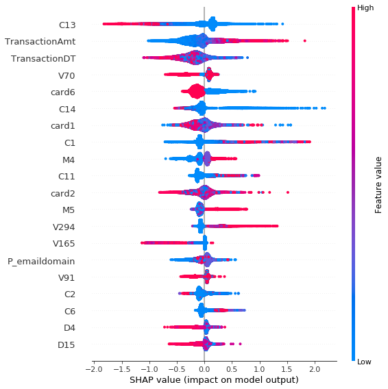

# Kaggle: IEEE-CIS Fraud Detection ([link](https://www.kaggle.com/c/ieee-fraud-detection/overview))

__Data__: 591 000 online payment transactions and 144 000 associated identities

__Task__: predict the probability that an identity has fraudulent transactions

__Evaluation__: area under the ROC curve

__Solution__: XGBoost classifier

__Success__: 0.937 AUC

